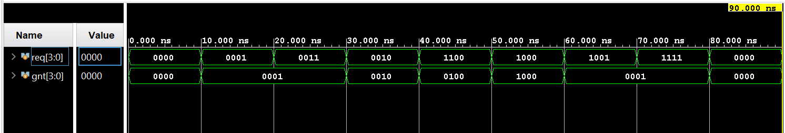

# fpga-arbiters

Parameterizable hardware arbiters in SystemVerilog, with self-checking testbenches, characterized with static timing analysis and demonstrated live on a Xilinx Basys3 (Artix-7) FPGA.


An arbiter grants a shared resource to exactly one of `N` competing requesters. It is the core of memory controllers, bus fabrics, NoC routers, and superscalar issue logic. This repo builds one from first principles: a combinational fixed-priority design, a starvation-free round-robin design, an O(log N) parallel-prefix optimization, and a working hardware demo.

## Features

- **Fixed-priority arbiter** (`rtl/fixed_priority_arbiter.sv`): parameterizable, purely combinational, O(N) priority cascade.
- **Round-robin arbiter** (`rtl/round_robin_arbiter.sv`): reuses the fixed-priority block twice around a one-hot rotating pointer. Fair, no starvation.
- **Kogge-Stone prefix-tree variant** (`rtl/fixed_priority_arbiter_tree.sv`): O(log N) depth, exhaustively equivalence-checked against the ripple version.
- **Self-checking testbenches**: every design enforces a one-hot-or-zero grant invariant automatically, in Vivado XSim.
- **Timing characterized on real silicon**: Fmax, critical path, and bandwidth measured across N = 4 to 32.
- **Live Basys3 demo**: slide switches drive requests, LEDs show the rotating grant, 7-segment shows the served requester.

## Hardware demo

Switches assert requests; the granted LED rotates fairly among only the active requesters, twice per second. The 7-segment display shows the index currently being served.


## Simulation

Fixed-priority: the grant follows the highest-priority active request, so a busy high-priority line starves the ones below it.



Round-robin: under constant demand (`req = 1111`) the grant rotates `r0`, `r1`, `r2`, `r3`, with the pointer one step ahead. No requester is starved.


## Results

Characterized on Artix-7 in Vivado by registering the I/O around the combinational arbiter and reading setup slack (WNS) against a 100 MHz constraint, where `Fmax = 1000 / (10 - WNS)`. Full write-up: [docs/notes/03-timing-analysis.md](docs/notes/03-timing-analysis.md).

| N  | WNS (ns) | Min period (ns) | Fmax (MHz) | Logic levels |
|----|----------|-----------------|------------|--------------|
| 4  | 8.320    | 1.680           | 595        | 1            |
| 8  | 7.531    | 2.469           | 405        | -            |
| 16 | 7.199    | 2.801           | 357        | -            |
| 32 | 3.848    | 6.152           | 163        | 6            |


Fmax falls as N grows — the O(N) priority cascade lengthening the critical path.

**O(log N) optimization.** Re-coding the ripple cascade as a Kogge-Stone parallel-prefix tree halves the critical-path depth at N=32 (6 to 3 logic levels) and raises Fmax by 34%:

| N = 32         | Fmax (MHz) | Logic levels |
|----------------|------------|--------------|
| Ripple cascade | 163        | 6            |
| Tree cascade   | **219**    | **3**        |

**Cost of fairness (N=4).** Round-robin adds a mask and an output mux in series with the cascade, lengthening the critical path from 1.68 ns to 3.04 ns (595 MHz to 330 MHz). Fixed priority is faster but starves; round-robin is fair but slower.

**Bandwidth.** At one grant per cycle over a 32-bit shared bus, aggregate throughput ranges from 19.0 Gbit/s (N=4) to 5.2 Gbit/s (N=32).

## Build and simulate

**Vivado GUI**
1. Add `rtl/` as design sources and `tb/` as simulation sources.
2. Set the desired testbench as the simulation-set top (`tb_fixed_priority_arbiter`, `tb_round_robin_arbiter`, `tb_arbiter_equiv`, `tb_arbiter_top`).
3. Flow Navigator > Run Simulation > Run Behavioral Simulation.

**Command line (Vivado XSim)**, from a shell with Vivado on your `PATH`:

```bash
cd sim
./run_xsim.sh tb_round_robin_arbiter
```

A clean run prints the per-cycle grant table with no `$error` lines.

**Hardware (Basys3)**
1. Set `arbiter_top` as the synthesis top.
2. Use `constraints/basys3_demo.xdc` as the active constraint file (disable `basys3.xdc`, which is timing-only).
3. Generate Bitstream, then Open Hardware Manager > Open Target > Auto Connect > Program Device.

## Repository layout

```
rtl/           synthesizable sources (arbiters, tree variant, slow_tick, top, timing harnesses)
tb/            self-checking testbenches
constraints/   XDC pin and timing files
sim/           XSim batch script
docs/notes/    per-phase concept and analysis write-ups
docs/images/   waveforms, plots, hardware demo
```

## Documentation

| Note | Topic |
|------|-------|
| [01](docs/notes/01-fixed-priority-arbiter.md) | Fixed priority, the one-hot invariant, starvation |
| [02](docs/notes/02-round-robin-arbiter.md) | Round robin, the rotating pointer, fairness |
| [03](docs/notes/03-timing-analysis.md) | Static timing analysis, Fmax, bandwidth, the prefix tree |
| [04](docs/notes/04-hardware-demo.md) | Clock enables vs clock division, the Basys3 demo |
| [SV vs Verilog](docs/notes/verilog-vs-systemverilog.md) | Side-by-side syntax reference |

## License

MIT, see [LICENSE](LICENSE).
