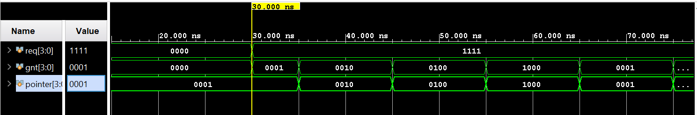

# fpga-arbiters

Parameterizable hardware arbiters in SystemVerilog for the Xilinx Basys3 (Artix-7), working from a combinational fixed-priority design up to round-robin, each with a self-checking testbench.


## Features

- Parameterizable `N`-input fixed-priority arbiter (`rtl/fixed_priority_arbiter.sv`) — purely combinational.
- Parameterizable `N`-input round-robin arbiter (`rtl/round_robin_arbiter.sv`) — reuses the fixed-priority block twice around a one-hot pointer register; fair, no starvation.
- One-hot-or-zero grant invariant on both designs, checked automatically in the testbenches.
- Self-checking testbenches (combinational and clocked) running in Vivado XSim.

## Usage

Fixed-priority (combinational):

```systemverilog
fixed_priority_arbiter #(.N(4)) u_fp (
    .req (req),
    .gnt (gnt)
);
```

Round-robin (clocked — needs a clock and an active-low reset):

```systemverilog
round_robin_arbiter #(.N(4)) u_rr (
    .clk   (clk),
    .rst_n (rst_n),
    .req   (req),
    .gnt   (gnt)
);
```

## Simulation

Fixed-priority — the grant follows the highest-priority active request; a busy high-priority line starves the ones below it:


Round-robin — under constant demand (`req = 1111`) the grant rotates `r0 → r1 → r2 → r3` and the pointer follows one step ahead, so no requester is starved:



## Build & simulate

**Vivado GUI**
1. Add `rtl/` as design sources and `tb/` as simulation sources.
2. Set the testbench you want to run (`tb_fixed_priority_arbiter` or `tb_round_robin_arbiter`) as the simulation-set top.
3. Flow Navigator -> Run Simulation -> Run Behavioral Simulation.

**Command line (Vivado XSim)** — from a shell with Vivado on your `PATH`:

```bash
cd sim
./run_xsim.sh tb_round_robin_arbiter   # or tb_fixed_priority_arbiter
```

A clean run prints the per-cycle grant table with no `$error` lines.

## Repository layout

```
rtl/           synthesizable design sources
tb/            testbenches / verification
constraints/   XDC pin & timing files (Phase 4, Basys3)
sim/           simulation scripts (XSim batch)
scripts/       project-generation Tcl (added later)
docs/notes/    per-phase concept write-ups
docs/images/   waveform screenshots, diagrams
```

## Roadmap

- [x] Phase 1 — Fixed-priority arbiter + self-checking testbench
- [x] Phase 2 — Round-robin arbiter (fairness, no starvation)
- [ ] Phase 3 — Datapath, bandwidth analysis, Vivado timing report (Fmax, critical path)
- [ ] Phase 4 — Basys3 demo (clock divider, LEDs / 7-segment)
- [ ] Phase 5 — Weighted round-robin, matrix arbiter, interview drills

## Status

In progress — Phases 1–2 complete and simulating cleanly. Measured Fmax and bandwidth numbers arrive in Phase 3.

## License

MIT — see [LICENSE](LICENSE).
