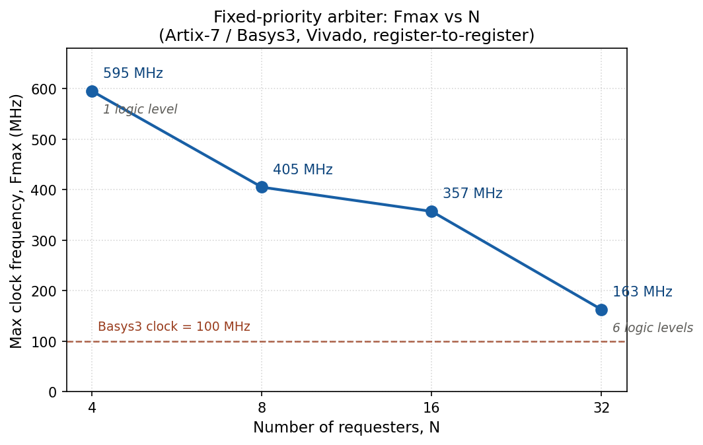

# Phase 3 — Timing & Bandwidth Analysis

## Goal
Move from *"does it work?"* to *"how fast is it, and how much can it move?"*
Measure the arbiter's maximum clock frequency (Fmax) and propagation delay on
real Artix-7 (Basys3) hardware using Vivado static timing analysis (STA), then
turn those into a throughput figure.

## Why a timing harness is needed
A purely combinational block has **no Fmax of its own** — Fmax is a property of
a *register-to-register* path, because the clock only has to be slow enough for
data launched by one flip-flop to reach the next before its capturing edge. The
fixed-priority arbiter has no registers, so there is nothing for STA to measure.

The fix is standard practice: place the block **between an input register and an
output register** (`rtl/timing_harness_fp.sv`) and declare a clock
(`constraints/basys3.xdc`: `create_clock -period 10.000` → 100 MHz). STA then
reports the slack on that path, and Fmax is back-calculated from it.

## Reading the timing report
STA reports three checks; only one bounds clock speed.

| Check | Question | Frequency-dependent? | Role |
|-------|----------|----------------------|------|
| **Setup (WNS)** | Is the *longest* path fast enough to finish within one clock period? | Yes | **Sets Fmax** — optimize this |
| Hold (WHS) | Is the *shortest* path so fast it corrupts the *same* edge? | No | Just needs to be met (was +0.14 ns) |
| Pulse width (WPWS) | Is the clock phase wide enough for the flops? | No | A clock check, constant at 4.5 ns |

Setup slack is a subtraction, and the flip-flop's setup time is one of the terms:

```
slack = T − (clk→Q + logic_delay + routing) − t_setup
```

`WNS` is the worst (smallest) setup slack across all paths. Fmax follows directly:

```
Fmax = 1 / (T − WNS) = 1000 / (10 − WNS)   [MHz]
```

## Results — fixed-priority arbiter (N = 4 … 32)

| N  | WNS (ns) | Min period (ns) | Fmax (MHz) | Logic levels |
|----|----------|-----------------|------------|--------------|
| 4  | 8.320    | 1.680           | 595        | 1 (LUT4)     |
| 8  | 7.531    | 2.469           | 405        | —            |
| 16 | 7.199    | 2.801           | 357        | —            |
| 32 | 3.848    | 6.152           | 163        | 6 (LUT3 + 5×LUT6) |



### What the numbers say
- **Fmax falls as N grows** — the O(N) priority cascade lengthens the critical
  path (more requesters → a deeper "is anyone above me asking?" chain).
- **The fall is step-like, not linear.** An FPGA builds logic from lookup
  tables, and a LUT6 absorbs any function of up to 6 inputs in a *single* logic
  level. So the ~31-gate cascade at N=32 packs into just 6 LUT levels, and Fmax
  only drops sharply when the cascade spills into another LUT level.
- **Cost per logic level ≈ (6.152 − 1.680) / (6 − 1) ≈ 0.9 ns/level** on this
  Artix-7 — and most of that is interconnect (routing between LUTs), not the
  LUT's own compute.

## Bandwidth (first-order model)
The arbiter grants one requester per clock. If each grant carries a `W`-bit word
across the shared resource, aggregate throughput = `W × Fmax`, and under fair
round-robin each of `k` active requesters gets ≈ `1/k` of it.

Example with a 32-bit shared bus (`W = 32`):

| N  | Fmax (MHz) | Aggregate = W × Fmax | Per requester (÷ N) |
|----|-----------|-----------------------|---------------------|
| 4  | 595       | 19.0 Gbit/s           | 4.8 Gbit/s          |
| 32 | 163       | 5.2 Gbit/s            | 0.16 Gbit/s         |

The tradeoff in one line: **more requesters buys more sharing, but a slower
clock and a thinner per-requester slice.**

## Round-robin comparison (N = 4)
Round-robin needs no harness — its pointer register already gives STA a clocked
`pointer -> logic -> pointer` path to measure directly.

| Arbiter (N=4)  | WNS (ns) | Min period (ns) | Fmax (MHz) |
|----------------|----------|-----------------|------------|
| Fixed-priority | 8.320    | 1.680           | 595        |
| Round-robin    | 6.965    | 3.035           | 330        |

**Fairness cost ≈ 1.36 ns of critical-path delay, dropping Fmax from ~595 MHz to
~330 MHz — about a 45% frequency hit at N=4.**

Where the delay went: round-robin's critical path no longer runs through a
single cascade. It runs `pointer -> mask (~(pointer-1)) -> masked fixed-priority
cascade -> output mux (masked vs fallback) -> pointer`. The bare cascade is the
floor; fairness stacks the mask and mux logic on top, in series, so the path is
longer. That is the fundamental arbiter tradeoff, measured: fixed priority is
faster but starves; round-robin is fair but slower.

*Caveat:* this isn't a perfectly matched comparison — the fixed-priority number
is a harness `reg -> cascade -> reg` path, while round-robin is its own
pointer-loop path. Both are valid "how fast can I clock this block" numbers, but
the path structures differ; a perfectly clean comparison would wrap both the
same way.

## Next
- **Optimization:** re-code the ripple cascade as a balanced **tree** (O(log N)
  depth instead of O(N)) and re-measure — the logic-level count, and the Fmax
  drop at large N, should shrink substantially. Same lesson as ripple-carry vs
  carry-lookahead adders, proven with measured numbers.
